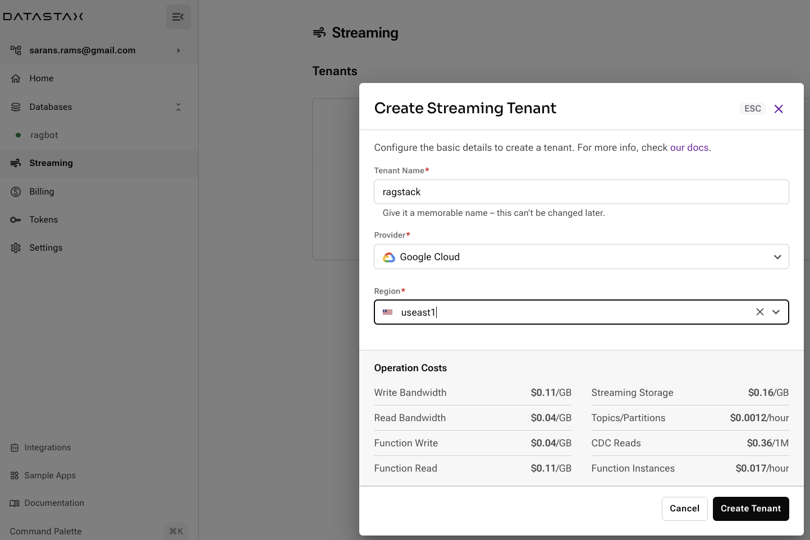
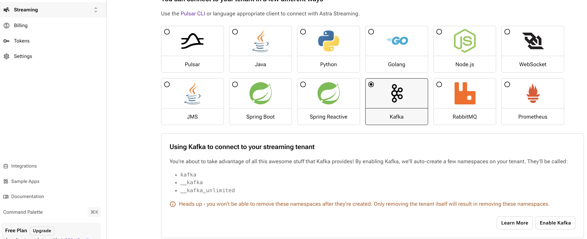
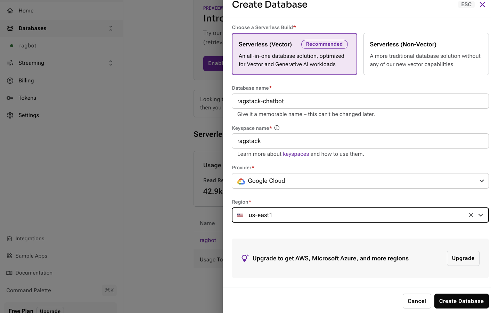
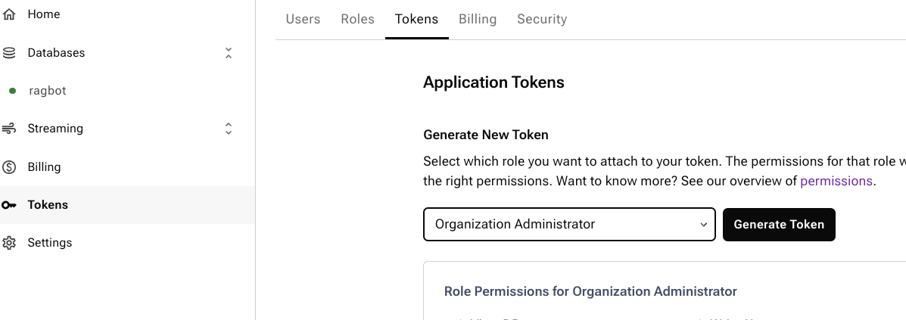

# RAGStack Astra

Welcome to DataStax Gen AI Dev Jam. This Dev Jam will help you quickly become familiar with DataStax RAGStack, LLMs and Astra Vector Database. These hands-on jam normally runs with a DataStax technical coach, self-paced and hands-on learning assignments. Bring in a Gen AI use case, your data and build a Gen AI chatbot using DataStax Astra platform.
This project is a starter for creating your production ready chatbot using Astra Vector Store, Streamlit, LangStream, LangChain and OpenAI. It's designed to be easy to deploy and use, with a focus on performance and usability. Let's Go!

This project covers how to:
- create a web crawler to crawl, extract webpage information, embed the documents and ingest using a pipeline with LangStream
- use Retrieval Augmented Generation (RAG) with LangChain to inquire about the contents of the webpage as they are ingested in real-time. 

## Getting Started

### Prerequisites

This workshop assumes you have access to:
1. [A Github account](https://github.com)
2. [AWS](https://console.aws.amazon.com)
3. [Astra](https://astra.datastax.com/). We signed up for Astra in our earlier part of the devjam. 
4. Install [docker](https://www.docker.com/get-started/)
5. Install Streamlit for UI

```python
pip install streamlit
```

#### Sign Up for AWS and create AWS Bucket. We will use the S3 bucket to store metadata of our website crawler

Create an AWS Bucket using this [guide](https://docs.aws.amazon.com/AmazonS3/latest/userguide/creating-bucket.html)
Generate a AWS secret key and access key using this [guide](https://docs.aws.amazon.com/IAM/latest/UserGuide/id_root-user_manage_add-key.html)

Gather the following information:

    - `S3_BUCKET_NAME`: Your S3 bucket name (for ex. ragstack-bucket )
    
    - `S3_ENDPOINT`: Your S3 endpoint (for ex. s3.us-east-1.amazonaws.com )

    - `S3_ACCESS_KEY`: Your S3 Access key

    - `S3_SECRET`: Your S3 secret key

    - `S3_REGION`: Your S3 region

#### Sign up for OpenAI (Skip, if you already created this in our earlier part of the devjam and want to reuse the same key)

- Create an [OpenAI account](https://platform.openai.com/signup) or [sign in](https://platform.openai.com/login).
- Navigate to the [API key page](https://platform.openai.com/account/api-keys) and create a new **Secret Key**, optionally naming the key.

#### Install LangStream

**Install LangStream:** Follow the [installation guide](https://github.com/LangStream/langstream#installation).
   
#### Create Astra Streaming Tenant

1. Login to [Astra](https://astra.datastax.com/) console.
2. Click on Streaming on the left menu and click Create Tenant. Refer [Guide](https://docs.datastax.com/en/streaming/astra-streaming/getting-started/index.html)
3. Create in the same region as our Vector Database created earlier. Refer below




4. Click on the Streaming tenant and navigate to connect tab. Enable Kafka interoperability as below




5. Download or Copy connectivity information for your streaming tenant. Gather the below information


    - `KAFKA_BOOTSTRAP_SERVERS`: Your bootstrap.servers url (for ex. kafka-gcp-useast1.streaming.datastax.com:9093 )
    
    - `KAFKA_USERNAME`: Your username endpoint (for ex. ragstack )

    - `KAFKA_PASSWORD`: Your Streaming tenant's token. Create one in your connect tab. Remember to append token: (for ex., token:****** )


#### Create Astra Database and a Token

1. Login to [Astra](https://astra.datastax.com/) console.
2. Click on Database and create a new database in the same region as the Streaming tenant as below



2. Click on Token on the left menu and select Organization Administrator toke as below. Download or Copy this information. 




3. Download the Astra secure conenct bundle. Follow instructions [here](https://awesome-astra.github.io/docs/pages/astra/download-scb/). Now  Gather the below information


    - `ASTRA_CLIENT_ID`: Your Astra Client ID (for ex. urk... )
    
    - `ASTRA_SECRET`: Your Astra Secret (for ex. NRu.. )

    - `ASTRA_TOKEN`: Your Astra Token

    - `ASTRA_DATABASE`: Your Astra Vector DB. We already created one in previous exercise. You can reuse the same. If not feel free to create new one

    - `ASTRA_SECURE_BUNDLE`: Fully qualified path to your downloaded secure connect bundle.

    - `ASTRA_DB_ID`: Your DB UUID.

#### Export all the below env properties 

```bash
export KAFKA_BOOTSTRAP_SERVERS=""
export KAFKA_USERNAME=""
export KAFKA_PASSWORD=""
export OPEN_AI_ACCESS_KEY=""
export ASTRA_CLIENT_ID=""
export ASTRA_SECRET=""
export ASTRA_TOKEN=""
export ASTRA_DATABASE=
export ASTRA_SECURE_BUNDLE=
export S3_BUCKET_NAME=
export S3_ENDPOINT=
export S3_ACCESS_KEY=
export S3_SECRET=
export S3_REGION=

```

#### Install CQLsh to connect to Astra Vector store


1. Download CQLsh and test the connectivity. Follow the instructions [here](https://awesome-astra.github.io/docs/pages/data/explore/cqlsh/)
2. Download secure connect Bundle based on the documentation here 
3. Connect your Astra Vector store

```bash
cd <path to secure connect bundle>/bin
/cqlsh -u ${ASTRA_CLIENT_ID} -p ${ASTRA_SECRET} -b ${PATH_TO_SECURE_BUNDLE.zip}
```
4. In the CQLsh propmpt once connected with a session to Astra Vector store. Try 

```bash
desc keyspaces;
```

#### Review the Configuration in the application\configuration.yaml. This sample crawls the cassio.org webpage, feel free to change this with your webpage. Feel free to change the Keyspace and Table name as required

```yaml
configuration:
  defaults:
    globals:
      assistantType: "RAGStack project"
      vectorKeyspace: "ragbotjam"
      vectorTable: "cassiodocs"
      chatTable: "cassiohistory"
      vectorIndex: "annragbot"
      chunksTopic: "ragbotjam-chunks"
      questionsTopic: "ragbotjam-questions"
      answersTopic: "ragbotjam-answers"
      chatModelName: "gpt-4"
      logTopic: "ragbotjam-logs"
      seedUrls: 
        - "https://cassio.org/"
      allowedUrls: 
        - "https://cassio.org/"
      forbiddenPaths: []
      vectorDb: ""

```

#### Let us run the pipeline using the below command.

```bash
langstream docker run ragstack-dev-jam -app application -i instances/astra.yaml -s secrets/secrets.yaml
```

Explore the logs as langstream spins of multiple agents that comprises a pipeline fo crawl, chunk, embed and store data in astra vector database.


#### Explore the data in your CQLsh session

1. Open a new terminal and Connect to your astra vector store using CqlSh 
2. Issue below command to explore the data loaded using the pipeline. You should see some data populated in the astra vector store

```SQL
>>> select * <keyspace>.<table> limit 2;
```

### Langchain conversational Chatbot

1. A chatbot implementation in Langchain is available in chatbot/chatbot.py. Explore the file. Uses the GPT4 OpenAI model for Chat completions
2. The Chatbot spawns a customer retriver to fetch relevant documents from Astra Vector store. Review the below query and change the keyspace and table as required

```SQL
    SELECT
        filename,
        text
    FROM ragstack.cassiodocs
    ORDER BY embeddings_vector ANN OF ?
    LIMIT ?
```

3. The Chatbot leverages the below PromptTemplate for Chat completions with OpenAI. Review the Prompt and tweak it to best acheive your requirement or use case. 

```
    You are an ai assistant helping users answer any queries regarding he cassio.org open source project.
    The retriever will help fetch relevant context to answer questions.
    Please try to leverage them in your answer as much as possible.
    Provide code samples and json files in a easy to read for developers.
    Take into consideration that the user is always asking questions relevant to the given context.
    Do not provide information that is not related to provided context.
    All the responses should be the same language as the user used.

```

4. Notice that the Chatbot stores the conversational history in the session and leverages it to answer the followup questions from user to provide better chat experience.

5. Start the Chatbot with below command. Ensure that you have the environemnt properties exported ( ASTRA_TOKEN, ASTRA_DB_ID, ASTRA_DB_KEYSPACE, OPENAI_API_KEY )

```bash
streamlit run chatbot/chatbot.py

```

6. Happy Chatting!